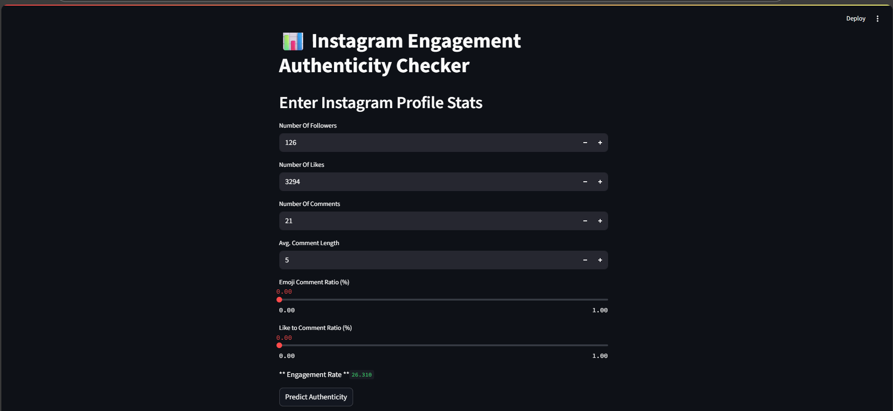

# 📱 Instagram Engagement Authenticity Checker

Detect whether an Instagram profile shows genuine engagement or likely fake interactions using machine learning. This app analyzes key statistics like follower count, likes, comments, and ratios to make predictions.

## 🔍 Project Overview

Fake engagement (bots, purchased likes/comments) is a common issue on social media. This machine learning-based web app helps identify such behavior by analyzing post engagement metrics.

### 🔗 [Live App on Render](https://authentigram.onrender.com)

---

## 📦 Features
- Input profile stats like likes, followers, and comments
- Real-time prediction of engagement authenticity
- Calculates key ratios like:
  - Emoji Comment Ratio
  - Like to Comment Ratio
  - Engagement Rate
- Shows prediction result as **Genuine** or **Fake**

---

### 🎯 Main Interface


> Users input Instagram metrics to analyze the authenticity.

---

## 📊 Input Features Used
| Feature | Description |
|--------|-------------|
| `Followers` | Total followers of the profile |
| `Likes` | Total likes on a post |
| `Comments` | Total comments |
| `Avg Comment Length` | Mean number of characters per comment |
| `Emoji Comment Ratio (%)` | Percentage of comments containing emojis |
| `Like to Comment Ratio (%)` | Ratio of likes to comments |
| `Engagement Rate` | Computed from other metrics, not an input |

---

## 🤖 Machine Learning Stack
- **Ensemble Model**: Combines Random Forest, Logistic Regression, and XGBoost
- **VotingClassifier**: For robust prediction
- **Accuracy**: ~90% on test data

---

## 🧰 Technologies Used
- Python
- Pandas / NumPy
- Scikit-learn
- XGBoost
- Streamlit (for UI)
- Joblib (for model saving/loading)

---

## 🧪 Getting Started

### 🔧 Installation
```bash
git clone https://github.com/gv-1280/DETECTION-OF-FAKE-ENGAGEMENTS-ON-INSTAGRAM-USING-MACHINE-LEARNING.git
pip install -r requirements.txt
streamlit run src/app.py

---

# 📈 Model Performance
Accuracy: ~90%

Balanced Precision & Recall across both fake and genuine profiles

Best Performing Base Model: Random Forest (part of Voting Ensemble)


## 🤖 Use Cases
Social media marketing analysis

Influencer vetting & fraud detection

Bot & engagement farm detection

Research in behavioral data science

### 📝 License
This project is licensed under the MIT License.

